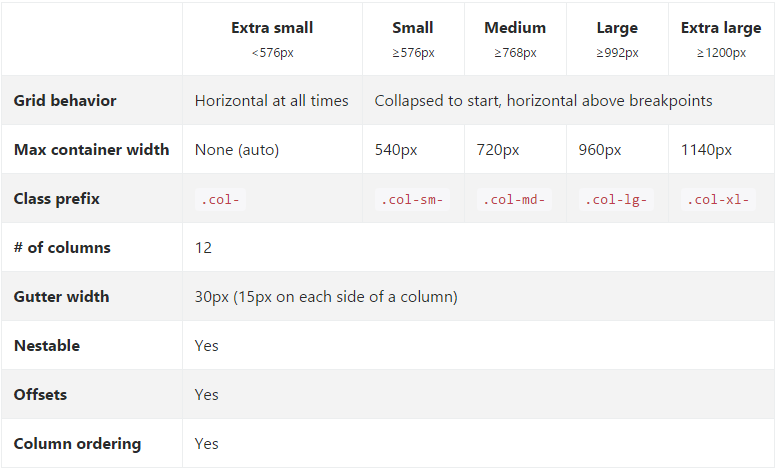

<!-- section start -->

<!-- attr: { class:'slide-title', showInPresentation:true, hasScriptWrapper:true, style:'' } -->
# Bootstrap 4
##  Alpha 6 for now (Jan 2017)
<div class="signature">
    <p class="signature-course">Web front-end development</p>
    <p class="signature-initiative">Telerik Software Academy</p>
    <a href = "https://academy.telerik.com " class="signature-link">https://academy.telerik.com </a>
</div>

<!--  -->


<!-- attr: { showInPresentation:true, hasScriptWrapper:true, style:'' } -->
# Table of Contents
- Bootstrap 4
  - v3 vs v4
  - Installation
- Layout
  - Grid
  - Alignment
  - Reordering
- Utilities

<!-- section start -->

<!-- attr: { class:'slide-section', showInPresentation:true, hasScriptWrapper:true, style:'' } -->
#  Bootstrap 4

<!--  -->

<!-- attr: { showInPresentation:true, hasScriptWrapper:true, style:'' } -->
# Bootstrap 3 vs 4

| Component        | v3   | v4           |
|:----------------:|:----:|:------------:|
| Source CSS       | LESS | SCSS         |
| Primary Units    | px   | rem          |
| Global Font Size | 14px | 16px         |
| Grid Tiers       | 4    | 6 (added XS) |

[Migration Guide](https://v4-alpha.getbootstrap.com/migration/) 

<!-- attr: { showInPresentation:true, hasScriptWrapper:true, style:'' } -->
# Bootstrap 4 - alpha 6

-  Bootstrap
  - Download at: https://v4-alpha.getbootstrap.com/
  - Bootstrap is developed mobile first

- Droped IE9 support
- Flexbox by default
- Automatic equal-width grid columns
- Utility classes
- Ready for beta version

<!-- attr: { showInPresentation:true, hasScriptWrapper:true, style:'' } -->
# Installation
- Download **ready to use** or **source**
- **Bootstrap CDN**
- **npm**, **RubyGems**, **Composer**, **Bower**, **NuGet**

```html
<!DOCTYPE html>
<html lang="en">
  ...
</html>
```

```html
<meta name="viewport" content="width=device-width, initial-scale=1, shrink-to-fit=no">
```

<!-- section start -->

<!-- attr: { class:'slide-section', showInPresentation:true, hasScriptWrapper:true, style:'' } -->
# Layout

<!-- attr: { showInPresentation:true, hasScriptWrapper:true, style:'' } -->
# Grid 
<!--  -->

<!-- attr: { showInPresentation:true, hasScriptWrapper:true, style:'' } -->
# How it works

- `.container` - center the site contents 
- `.row` - horizontal group of columns
  - only **cols** could be immediate children of **rows**
- `.col` -  thanks to flexbox automatically with equal width
- grid tiers are based on minimum widths

<!-- attr: { showInPresentation:true, hasScriptWrapper:true, style:'' } -->
# col

- **col** - equal-width columns
- **col-5** - setting only one col width
- **col-{breakpoint}-auto** - width of the content
- **w-100** - multi-row columns
- **col-{breakpoint}-{number}** - responsive on layouts on all devices

<!-- attr: { showInPresentation:true, hasScriptWrapper:true, style:'' } -->
# Alignment

- Vertical
  - **align-items-{breakpoint}-{position}**
  - **align-self-{breakpoint}-{position}**

- Horizontal
  - **justify-content-{breakpoint}-{position}**

- Column wrapping
  -  **if more than 12** => each group of extra columns will wrap onto a new line

<!-- attr: { showInPresentation:true, hasScriptWrapper:true, style:'' } -->
# no-gutters
- The gutters between columns in our predefined grid classes can be removed

  - `scss`

```scss
.no-gutters {
  margin-right: 0;
  margin-left: 0;

  > .col,
  > [class*="col-"] {
    padding-right: 0;
    padding-left: 0;
  }
}
```

<!-- attr: { showInPresentation:true, hasScriptWrapper:true, style:'' } -->
# Reordering

- **flex-{breakpoint}-{order}** - order of the columns
  - **flex-unordered**

- **offset-{breakpoint}-{number}**  - offsets

- **push(pull)-{breakpoint}-{number}** - change the order of the columns

<!-- section start -->

<!-- attr: { class:'slide-section', showInPresentation:true, hasScriptWrapper:true, style:'' } -->
# Utilities

<!-- attr: { showInPresentation:true, hasScriptWrapper:true } -->
# Utilities
- Classes with single purpose
  - **Reduce the frequency of highly repetetive declarations**

- **Borders** - `border-{side}-0(1)`
- **Clearfix** - `clearfix`
- **Flexbox** - `d-flex`, `d-inline-flex`
- **Display** - `d-block`, `d-inline`,`d-inline-block`


<!-- attr: { showInPresentation:true, hasScriptWrapper:true } -->
# Utilities
- **Spacing**
  - `{property}{sides}-{breakpoint}-{size}`

- **property** - `m,p`
- **sides** - `t,b,l,r,x,y`
- **size** - `0...5`

- You can add more sizes by adding entries to the **$spacers** Sass variable

<!-- section start -->
<!-- attr: {id: 'questions', class: 'slide-section', hasScriptWrapper:true} -->
# Questions


<!-- attr: { showInPresentation: true, hasScriptWrapper: true} -->
# Free Training @ Telerik Academy

- Web front-end development Course
  - [Web front-end development](http://telerikacademy.com/Courses/Courses/Details/414)
- Telerik Software Academy
  - [telerikacademy.com](https://telerikacademy.com)
- Telerik Academy @ Facebook
  - [facebook.com/TelerikAcademy](https://facebook.com/TelerikAcademy)
- Telerik Academy Learning System
  - [telerikacademy.com](https://telerikacademy.com)
